# Pipeline Architecture

## 1. Full Pipeline Flowchart

```mermaid
flowchart TB
    subgraph INPUTS["<b>Raw Inputs</b>"]
        direction LR
        ftir_excel["FTIR Excel/CSV<br/><i>particles, materials,<br/>quality, x/y coords</i>"]
        raman_excel["Raman CSV<br/><i>particles, materials,<br/>HQI, x/y coords</i>"]
        ldir_excel["LDIR Excel<br/><i>particles, materials,<br/>quality, sizes<br/>(NO coordinates)</i>"]
        ftir_img["FTIR Image (.png)<br/><i>Absorption heatmap<br/>~3000×3000 px</i>"]
        ldir_img["LDIR Image (.png)<br/><i>Colored particle map<br/>~2400×2400 px</i>"]
        raman_img["Raman Image (.jpg)<br/><i>Optical overview<br/>~5000×4834 px</i>"]
    end

    subgraph INGEST["<b>1. Data Ingestion</b>"]
        direction TB
        ingest_ftir["ingest_ftir()<br/><i>R/01_ingest.R</i>"]
        ingest_raman["ingest_raman()<br/><i>R/01_ingest.R</i>"]
        ingest_ldir["ingest_ldir()<br/><i>R/01c_ingest_ldir.R</i>"]
        python_detect["Python backend<br/><i>inst/python/particle_detector.py<br/>1. Per-tile sigma-clipping BG correction<br/>2. Global threshold detection<br/>3. Auto-tune threshold → target count<br/>4. Pixel centroid extraction</i>"]
        r_fallback["R fallback<br/><i>Saturation segmentation<br/>(if Python unavailable)</i>"]
        join_ldir["join_ldir_coords()<br/><i>Hungarian assignment<br/>on vectorised log-ratio cost<br/>+ scan-order validation (τ)</i>"]
    end

    subgraph PREFILTER["<b>2. Pre-filtering</b>"]
        direction TB
        filter_plastic["Extract PLASTIC subsets<br/><i>PET, PP only<br/>(reliable cross-instrument)</i>"]
        filter_raman_size["Filter Raman ≥ 20 µm<br/><i>Must be visible to FTIR</i>"]
        filter_quality["Quality thresholds<br/><i>FTIR quality, Raman HQI,<br/>LDIR quality</i>"]
        split["Split into:<br/><b>*_for_align</b> (plastic anchors)<br/><b>*_for_match</b> (all particles)"]
    end

    subgraph NORMALIZE["<b>3. Coordinate Normalization</b>"]
        direction TB
        centroids["Compute centroids<br/><i>from PLASTIC subset only</i>"]
        center_ftir["FTIR: x_norm = x_um − centroid"]
        center_raman["Raman: x_norm = x_um − centroid"]
        center_ldir["LDIR: x_norm = x_um − centroid"]
    end

    subgraph ALIGN_FR["<b>4. FTIR → Raman Alignment</b>"]
        direction TB
        tier1["<b>Tier 1: Landmarks</b><br/><i>Large particles (>100 µm)<br/>+ fibers (aspect > 3)<br/>Rigid transform fit</i>"]
        tier1_check{"Confident?<br/><i>inliers > 50%<br/>residual < 50 µm</i>"}
        tier2["<b>Tier 2: RANSAC</b><br/><i>Grid search<br/>rotation (1° steps)<br/>× scale (0.9–1.1)<br/>Count inliers < 200 µm</i>"]
        icp_fr["<b>ICP Refinement</b><br/><i>Iterative closest point<br/>Weighted SVD<br/>Downweight fibers<br/>Until RMS converges</i>"]
        transform_fr["Output: M_ftir<br/><i>3×3 homogeneous matrix<br/>(rotation + scale + translation)<br/>Typical: RMS ~16 µm</i>"]
    end

    subgraph ALIGN_LR["<b>5. LDIR → Raman Alignment</b>"]
        direction TB
        ransac_lr["RANSAC<br/><i>Same grid search<br/>on LDIR plastic anchors<br/>(PET, PP, PC)</i>"]
        icp_lr["ICP Refinement<br/><i>Same iterative process</i>"]
        quality_check{"ICP RMS > 100 µm?"}
        quality_warn["WARN: Check<br/>ldir_scan_diameter_um<br/>config setting"]
        transform_lr["Output: M_ldir<br/><i>3×3 homogeneous matrix</i>"]
    end

    subgraph APPLY["<b>6. Apply Transforms</b>"]
        direction TB
        apply_ftir["FTIR: [x,y,1]_aligned<br/>= M_ftir × [x,y,1]_norm"]
        apply_ldir["LDIR: [x,y,1]_aligned<br/>= M_ldir × [x,y,1]_norm"]
        raman_ref["Raman: x_aligned = x_norm<br/><i>(reference frame, unchanged)</i>"]
    end

    subgraph MATCH["<b>7. Particle Matching</b>"]
        direction TB
        match_fr["FTIR ↔ Raman<br/><i>Hungarian algorithm<br/>Cost = distance +<br/>area + feret + aspect<br/>Max 100 µm + 0.15×major</i>"]
        match_lr["LDIR ↔ Raman<br/><i>Same algorithm</i>"]
        match_lf["LDIR ↔ FTIR<br/><i>Both in Raman frame<br/>Direct spatial match</i>"]
        triplets["3-Way Triplets<br/><i>Shared raman_particle_id<br/>in FR + LR matches<br/>+ material consensus scoring<br/>n_instrument_agreement: 0–3</i>"]
        composites["Composite Matches<br/><i>1 FTIR → N Raman fragments<br/>Area ratio 0.3–5.0</i>"]
    end

    subgraph AGREEMENT["<b>8. Agreement Analysis</b>"]
        direction TB
        normalize_mat["Normalize material names<br/><i>Extract abbreviation<br/>from parentheses</i>"]
        classify["Classify polymer family<br/><i>PET, PP, PE, PS, PVC,<br/>PA, PC, PMMA, Rubber,<br/>Cellulose, Natural, ...<br/>Note: 'Polyamide (naturally occurring)'<br/>→ Natural (not PA)</i>"]
        tier_score["Score agreement tier<br/><i><b>Exact</b>: same family + name<br/><b>Family</b>: same family<br/><b>Disagree</b>: different family</i>"]
        confusion["Confusion matrix<br/><i>FTIR × Raman materials</i>"]
    end

    subgraph TPS["<b>9. Distortion Assessment</b>"]
        direction TB
        quadrant["Split matches into<br/>4 spatial quadrants"]
        residuals["Compute residual vectors<br/><i>per quadrant</i>"]
        tps_check{"Systematic distortion?<br/><i>dx or dy range > 20 µm</i>"}
        tps_rec["Recommend TPS<br/><i>thin-plate spline</i>"]
    end

    subgraph DIAGNOSTICS["<b>10. Diagnostics</b>"]
        direction LR
        p1["Overlay plot"]
        p2["Distance histogram"]
        p3["ICP convergence"]
        p4["Residual scatter"]
        p5["Residual vectors"]
        p6["Confusion heatmap"]
        p7["Size comparison"]
        p8["Ambiguity dist."]
        p9["Tiered agreement"]
        p10["LDIR plots"]
    end

    subgraph EXPORT["<b>11. Export Results</b>"]
        direction TB
        csv_out["CSVs:<br/><i>matched_particles<br/>unmatched_ftir/raman/ldir<br/>agreement_summary/pairwise<br/>ldir_*_matched<br/>triplets_3way (+ consensus)<br/>ldir_image_extracted<br/>triage_top_pairs</i>"]
        txt_out["Transform params:<br/><i>3×3 matrix, centroids<br/>scale, rotation_deg<br/>match_statistics</i>"]
        plot_out["Plots:<br/><i>11+ PNGs<br/>all_diagnostics.pdf</i>"]
    end

    subgraph SHINY["<b>12. Shiny App</b>"]
        direction TB
        load_run["Auto-load latest<br/>pipeline output"]
        tab_ftir["<b>FTIR Tab</b><br/><i>Native coords + image<br/>Filter: quality, size,<br/>material, match status</i>"]
        tab_raman["<b>Raman Tab</b><br/><i>Native coords<br/>Same filters</i>"]
        tab_ldir["<b>LDIR Tab</b><br/><i>Native coords<br/>3 image layers:<br/>raw / processed / extracted</i>"]
        tab_overlay["<b>Overlay Tab</b><br/><i>All instruments<br/>in Raman frame<br/>+ Triple match rings (gold)</i>"]
        interactive["Interactive:<br/><i>Hover tooltips<br/>Brush zoom<br/>Image offsets<br/>Layer toggles</i>"]
    end

    %% Connections
    ftir_excel --> ingest_ftir
    raman_excel --> ingest_raman
    ldir_excel --> ingest_ldir
    ldir_img --> python_detect
    python_detect -->|"primary path"| join_ldir
    ldir_img --> r_fallback
    r_fallback -->|"Python unavailable"| join_ldir
    ingest_ldir --> join_ldir

    ingest_ftir --> filter_plastic
    ingest_raman --> filter_plastic
    join_ldir --> filter_plastic
    filter_plastic --> filter_raman_size --> filter_quality --> split

    split --> centroids
    centroids --> center_ftir
    centroids --> center_raman
    centroids --> center_ldir

    center_ftir --> tier1
    center_raman --> tier1
    tier1 --> tier1_check
    tier1_check -->|Yes| icp_fr
    tier1_check -->|No| tier2
    tier2 --> icp_fr
    icp_fr --> transform_fr

    center_ldir --> ransac_lr
    center_raman --> ransac_lr
    ransac_lr --> icp_lr
    icp_lr --> quality_check
    quality_check -->|Yes| quality_warn
    quality_check -->|No| transform_lr
    quality_warn --> transform_lr

    transform_fr --> apply_ftir
    transform_lr --> apply_ldir
    center_raman --> raman_ref

    apply_ftir --> match_fr
    raman_ref --> match_fr
    apply_ldir --> match_lr
    raman_ref --> match_lr
    apply_ftir --> match_lf
    apply_ldir --> match_lf
    match_fr --> triplets
    match_lr --> triplets
    match_fr --> composites

    match_fr --> normalize_mat
    match_lr --> normalize_mat
    normalize_mat --> classify --> tier_score --> confusion

    match_fr --> quadrant --> residuals --> tps_check
    tps_check -->|Yes| tps_rec

    match_fr --> p1
    confusion --> p6

    csv_out --> load_run
    txt_out --> load_run
    load_run --> tab_ftir
    load_run --> tab_raman
    load_run --> tab_ldir
    load_run --> tab_overlay
    tab_overlay --> interactive

    ftir_img --> tab_ftir
    ldir_img --> tab_ldir
    raman_img --> tab_overlay

    style INPUTS fill:#e1f5fe,stroke:#0288d1
    style INGEST fill:#f3e5f5,stroke:#7b1fa2
    style PREFILTER fill:#fff3e0,stroke:#ef6c00
    style NORMALIZE fill:#e8f5e9,stroke:#2e7d32
    style ALIGN_FR fill:#fce4ec,stroke:#c62828
    style ALIGN_LR fill:#fce4ec,stroke:#c62828
    style APPLY fill:#e8eaf6,stroke:#283593
    style MATCH fill:#fff9c4,stroke:#f9a825
    style AGREEMENT fill:#f1f8e9,stroke:#558b2f
    style TPS fill:#efebe9,stroke:#4e342e
    style DIAGNOSTICS fill:#e0f2f1,stroke:#00695c
    style EXPORT fill:#fafafa,stroke:#424242
    style SHINY fill:#e3f2fd,stroke:#1565c0
```

## 2. Coordinate and Image Alignment Flowchart

```mermaid
flowchart TB
    subgraph FTIR_COORDS["<b>FTIR Coordinate Pipeline</b>"]
        direction TB

        ftir_raw["<b>Raw FTIR Coordinates</b><br/><i>From CSV: x_um, y_um<br/>Frame: instrument grid<br/>Y-axis: up (Cartesian)<br/>Range: ~[0, 12475] µm</i>"]

        ftir_norm["<b>Normalized</b><br/><i>x_norm = x_um − centroid_x<br/>y_norm = y_um − centroid_y<br/>Centroid from PLASTIC subset<br/>Range: ~[−6200, +6200]</i>"]

        ftir_aligned["<b>Aligned (Raman frame)</b><br/><i>[x, y, 1]_aligned = M × [x, y, 1]_norm<br/><br/>M ≈ | −1  0  tx |  (≈180° rotation)<br/>    |  0 −1  ty |<br/>    |  0  0   1 |<br/><br/>ICP RMS ≈ 16 µm (typical)</i>"]

        ftir_raw --> |"subtract<br/>ftir_centroid"| ftir_norm
        ftir_norm --> |"apply M_ftir<br/>(ICP output)"| ftir_aligned
    end

    subgraph RAMAN_COORDS["<b>Raman Coordinate Pipeline</b>"]
        direction TB

        raman_raw["<b>Raw Raman Coordinates</b><br/><i>From CSV: x_um, y_um<br/>Frame: instrument stage<br/>Y-axis: up (Cartesian)<br/>Range: ~[−5500, +6600] µm</i>"]

        raman_norm["<b>Normalized = Reference Frame</b><br/><i>x_norm = x_um − centroid_x<br/>y_norm = y_um − centroid_y<br/>Centroid from PLASTIC subset<br/><br/>This IS the aligned frame.<br/>All other instruments<br/>transform TO this frame.</i>"]

        raman_raw --> |"subtract<br/>raman_centroid"| raman_norm
    end

    subgraph LDIR_COORDS["<b>LDIR Coordinate Pipeline</b>"]
        direction TB

        ldir_none["<b>Excel Data</b><br/><i>NO coordinates<br/>Only: sizes, materials,<br/>quality scores</i>"]

        ldir_python["<b>Python Detection</b><br/><i>inst/python/particle_detector.py<br/>1. Grayscale conversion<br/>2. 4×4 tile BG correction<br/>   (sigma-clipping Gaussian)<br/>3. Global threshold + CCL<br/>4. Auto-tune threshold<br/>   to match Excel count</i>"]

        ldir_r_fallback["<b>R Fallback</b><br/><i>HSV saturation > 0.3<br/>Adaptive threshold<br/>(if Python unavailable)</i>"]

        ldir_physical["<b>Physical Coordinates</b><br/><i>x_um = centroid_x / width × extent<br/>y_um = extent − centroid_y / height × extent<br/>Y-flip: image row 0 (top) → y_max<br/>Extent = ldir_scan_diameter_um</i>"]

        ldir_joined["<b>Joined with Excel</b><br/><i>Vectorised log-ratio cost matrix<br/>outer(log area, log feret)<br/>Hungarian assignment<br/>(cost < 2.0 threshold)<br/>Validated via scan-order<br/>Kendall τ correlation<br/>Typical join rate: ~99%</i>"]

        ldir_norm["<b>Normalized</b><br/><i>x_norm = x_um − centroid_x<br/>y_norm = y_um − centroid_y<br/>Centroid from PLASTIC subset</i>"]

        ldir_aligned["<b>Aligned (Raman frame)</b><br/><i>[x, y, 1]_aligned = M × [x, y, 1]_norm<br/><br/>Separate M_ldir matrix<br/>(own RANSAC + ICP)<br/>Quality check: warn if RMS > 100 µm</i>"]

        ldir_none --> ldir_joined
        ldir_python -->|"primary"| ldir_physical
        ldir_r_fallback -->|"fallback"| ldir_physical
        ldir_physical --> ldir_joined
        ldir_joined --> |"subtract<br/>ldir_centroid"| ldir_norm
        ldir_norm --> |"apply M_ldir<br/>(ICP output)"| ldir_aligned
    end

    subgraph ICP_DETAIL["<b>ICP Registration Detail (runs twice: FTIR→Raman, LDIR→Raman)</b>"]
        direction TB

        coarse["<b>Coarse Alignment</b><br/><i>Tier 1: Landmark (large particles, fibers)<br/>Tier 2: RANSAC (1° rotation × scale grid)</i>"]

        icp_init["Initialize from<br/>coarse transform"]

        icp_loop["<b>ICP Loop (max 100 iter)</b><br/><i>1. Find nearest Raman neighbor for each source pt<br/>2. Reciprocal filter (forward + backward NN agree)<br/>3. Trim worst 10% by distance<br/>4. Weighted SVD → rotation + scale + translation<br/>   (downweight elongated particles)<br/>5. Compute RMS error</i>"]

        icp_conv{"RMS change<br/>< 0.01 µm?"}

        icp_out["<b>Output</b><br/><i>M (3×3 matrix)<br/>scale, rotation_deg<br/>tx, ty, RMS history</i>"]

        coarse --> icp_init --> icp_loop --> icp_conv
        icp_conv -->|No| icp_loop
        icp_conv -->|Yes| icp_out
    end

    subgraph FTIR_IMAGE["<b>FTIR Image Handling</b>"]
        direction TB

        ftir_img_raw["<b>Raw PNG</b><br/><i>Absorption heatmap<br/>~2993 × 2993 px<br/>Row 1 = top of scan area</i>"]

        ftir_img_bounds["<b>Compute Physical Bounds</b><br/><i>grid_cells = (px + 1) / 6<br/>extent = grid_cells × 25 µm<br/>≈ 12,475 µm</i>"]

        ftir_native_display["<b>FTIR Tab Display</b><br/><i>annotation_raster(<br/>  img,<br/>  xmin=0, xmax=12475,<br/>  ymin=0, ymax=12475<br/>)<br/><br/>Particles: x_orig, y_orig<br/>No transform needed<br/>No flip needed</i>"]

        ftir_overlay_display["<b>Overlay Tab Display</b><br/><i>Affine warp via M_full:<br/>For each output pixel →<br/>inverse-transform → sample<br/>source pixel<br/><br/>Image warped to Raman frame<br/>Particles: x_aligned, y_aligned</i>"]

        ftir_img_raw --> ftir_img_bounds
        ftir_img_bounds --> ftir_native_display
        ftir_img_bounds --> ftir_overlay_display
    end

    subgraph LDIR_IMAGE["<b>LDIR Image Handling</b>"]
        direction TB

        ldir_img_raw["<b>Raw PNG</b><br/><i>Colored particle map<br/>~2400 × 2400 px<br/>Row 1 = top (y_um ≈ 0 in image coords)</i>"]

        ldir_problem["<b>Y-Axis Mismatch</b><br/><i>Image: row 1 = small y_um (top)<br/>ggplot: y=0 at bottom<br/>annotation_raster: row 1 → ymax<br/>→ INVERTED without fix</i>"]

        ldir_flip["<b>Fix: Physical Row Reversal</b><br/><i>flipped = raw[nrow:1, , ]<br/>Now row 1 = large y_um side<br/>→ placed at ymax (plot top)<br/>→ matches particle coordinates</i>"]

        ldir_raw_display["<b>Raw Image Layer</b><br/><i>annotation_raster(flipped)<br/>LDIR tab: always shown</i>"]

        ldir_processed["<b>Processed Image Layer</b><br/><i>Python: BG-corrected view<br/>(green-tinted, optional)<br/>Fallback: saturation mask</i>"]

        ldir_extracted["<b>Extracted Points Layer</b><br/><i>ldir_image_extracted.csv<br/>Pink open circles<br/>Pre-join centroids</i>"]

        ldir_img_raw --> ldir_problem --> ldir_flip
        ldir_flip --> ldir_raw_display
        ldir_flip --> ldir_processed
        ldir_img_raw --> ldir_extracted
    end

    subgraph OVERLAY_IMAGE["<b>Overlay Image Handling (raman_resized.jpg)</b>"]
        direction TB

        overlay_img_raw["<b>Raw JPEG</b><br/><i>Optical overview<br/>5000 × 4834 px<br/>Covers full 13mm filter</i>"]

        overlay_bounds["<b>Compute Bounds</b><br/><i>Use FTIR + Raman extents ONLY<br/>(not LDIR — coarser alignment)<br/><br/>20% padding on each side<br/>Enforce image aspect ratio</i>"]

        overlay_display["<b>Overlay Tab Display</b><br/><i>annotation_raster(raman_img, ...)<br/><br/>Layers (toggleable):<br/>+ FTIR (x_aligned, green △)<br/>+ Raman (x_norm, blue ●)<br/>+ LDIR (x_aligned, purple ◆)<br/>+ Match lines (grey)<br/>+ Triple matches (gold ○, 6pt ring)</i>"]

        overlay_img_raw --> overlay_bounds --> overlay_display
    end

    subgraph DISPLAY_SUMMARY["<b>Display Coordinate Summary</b>"]
        direction TB

        ds1["<b>FTIR Tab</b><br/>Particles: x_orig, y_orig<br/>Image: [0, scan_max] µm<br/>No flip"]

        ds2["<b>Raman Tab</b><br/>Particles: x_orig, y_orig<br/>Image: user-uploaded only<br/>No flip"]

        ds3["<b>LDIR Tab</b><br/>Particles: x_orig, y_orig<br/>Image: [0, extent] µm<br/><b>Rows flipped vertically</b><br/>3 optional overlays"]

        ds4["<b>Overlay Tab</b><br/>All particles in Raman frame:<br/>  FTIR → x_aligned<br/>  Raman → x_norm<br/>  LDIR → x_aligned<br/>Image: FTIR+Raman extent<br/>Triple match rings: gold"]
    end

    %% Cross-subgraph connections
    ftir_aligned -.->|"used in"| ftir_overlay_display
    ftir_aligned -.->|"displayed as"| ds4
    raman_norm -.->|"reference for"| ds4
    ldir_aligned -.->|"displayed as"| ds4

    style FTIR_COORDS fill:#e8f5e9,stroke:#2e7d32
    style RAMAN_COORDS fill:#e3f2fd,stroke:#1565c0
    style LDIR_COORDS fill:#f3e5f5,stroke:#7b1fa2
    style ICP_DETAIL fill:#fce4ec,stroke:#c62828
    style FTIR_IMAGE fill:#e8f5e9,stroke:#2e7d32
    style LDIR_IMAGE fill:#f3e5f5,stroke:#7b1fa2
    style OVERLAY_IMAGE fill:#fff3e0,stroke:#ef6c00
    style DISPLAY_SUMMARY fill:#fafafa,stroke:#424242
```

## 3. Analysis Findings & Improvement Notes

### Current Pipeline Performance (2026-02-19 run)

| Metric | Value | Notes |
|--------|-------|-------|
| FTIR→Raman ICP RMS | 16.6 µm | Excellent — landmark alignment succeeded |
| LDIR→Raman ICP RMS | 149.7 µm | Poor — see LDIR alignment section |
| FTIR match rate | 89.4% | 322/360 matched |
| LDIR image join rate | 99.6% | 503/505 via Python backend |
| LDIR→Raman matches | 67 pairs | |
| Three-way triplets | 26 total | Material consensus varies |
| FTIR→Raman agreement | 11.5% family+ | Low — see material issues |

### Why LDIR Spatial Alignment Is Poor

The LDIR→Raman ICP converges to ~150 µm RMS vs ~17 µm for FTIR→Raman. Root causes:

1. **Scan area mismatch**: `ldir_scan_diameter_um = 13000 µm` assumes a 13 mm square scan. If the actual scan area is smaller or non-square, all pixel→µm coordinate mappings are wrong by a constant factor.

2. **Sparse anchors**: LDIR RANSAC uses only PET, PP, and PC particles. If these are few in number or spatially clustered, the initial RANSAC rotation estimate can be off by a large angle.

3. **No direct reference**: LDIR aligns to Raman indirectly. Since LDIR and FTIR scan the same filter area, aligning LDIR→FTIR first (smaller spatial difference expected) before mapping to Raman via M_ftir could improve results.

**Diagnostic**: Check `plots/ldir_overlay.png` — if LDIR particles are systematically offset from Raman in one direction, the scan bounds need adjustment.

### Why Triplet Material Agreement Is Low

Of 26 triplets in the test dataset, most show `material_consensus = "No agreement"`. Key observations:

1. **FTIR "Protein" matches**: Many FTIR particles classified as "Protein" spatially match Raman particles classified as "Polyacrylamide/acrylate" or "CAB". This could be:
   - A genuine scientific finding (surface protein coating on synthetic particles)
   - Spatial matching artifacts from the large match distance threshold (100 µm)
   - FTIR spectral confusion between protein amide bands and acrylate carbonyl bands

2. **LDIR "Polyamide (naturally occurring)"**: Previously misclassified as synthetic PA (nylon). Now correctly mapped to the "Natural" family, reducing false material agreements with synthetic PA/Nylon from other instruments.

3. **Poor LDIR spatial alignment**: An LDIR–Raman ICP RMS of 150 µm means the LDIR spatial matches themselves are uncertain. Several LDIR particles may be matched to the wrong Raman particle.

### Key Redundancies Found

| Location | Redundancy | Status |
|----------|-----------|--------|
| `R/01c_ingest_ldir.R` | O(n×m) nested loop for cost matrix | Fixed: replaced with `outer()` |
| `R/08b_material_map.R` | PA regex did not exclude "naturally occurring" | Fixed: updated negative lookahead |
| `R/08_agreement.R` + `08b_material_map.R` | Double normalization path when no config mapping | Acceptable: normalize_material() is fallback only |
| `R/07_match.R` + `R/01c_ingest_ldir.R` | Similar log-ratio cost logic in two places | Minor: different column names prevent clean sharing |
